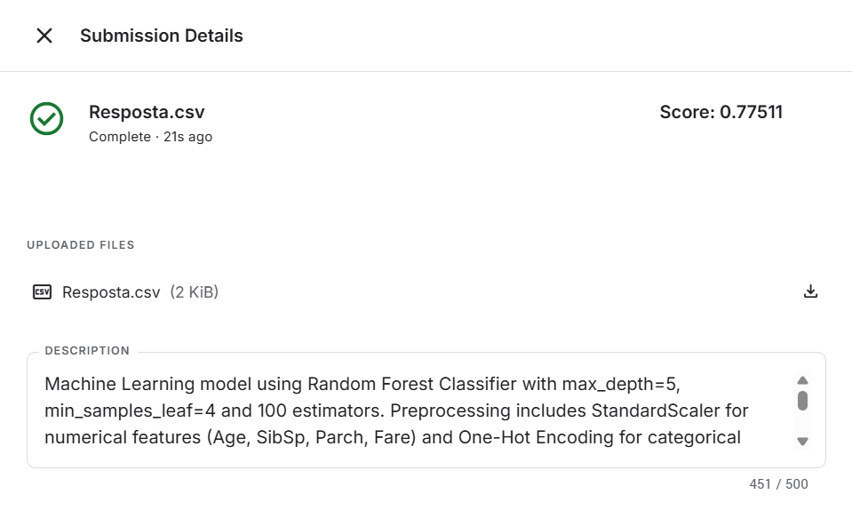

# Tentativa 1

## Modelo
- **Algoritmo:** Random Forest Classifier
- **Hiperparâmetros:** max_depth=5, n_estimators=100

## Pré-processamento
- **Features numéricas:** Age, SibSp, Parch, Fare → StandardScaler
- **Features categóricas:** Sex, Embarked, Title → OneHotEncoder (drop='first')
- **Feature engineering:** Título extraído da coluna Name utilizando Regex

## Resultados
- **Acurácia no treino:** 83%
- **Acurácia na validação:** 83%
- **Score no Kaggle:** 0.77511

## Observações
- Overfitting observado com valores mais altos de max_depth
- Possíveis melhorias: tratar nulos de Age usando o título (Master), adicionar feature FamilySize